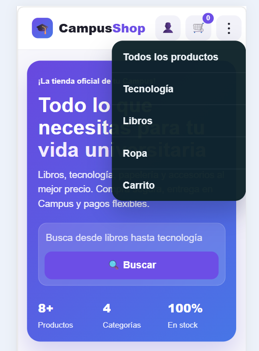
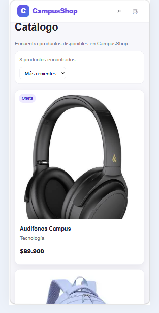
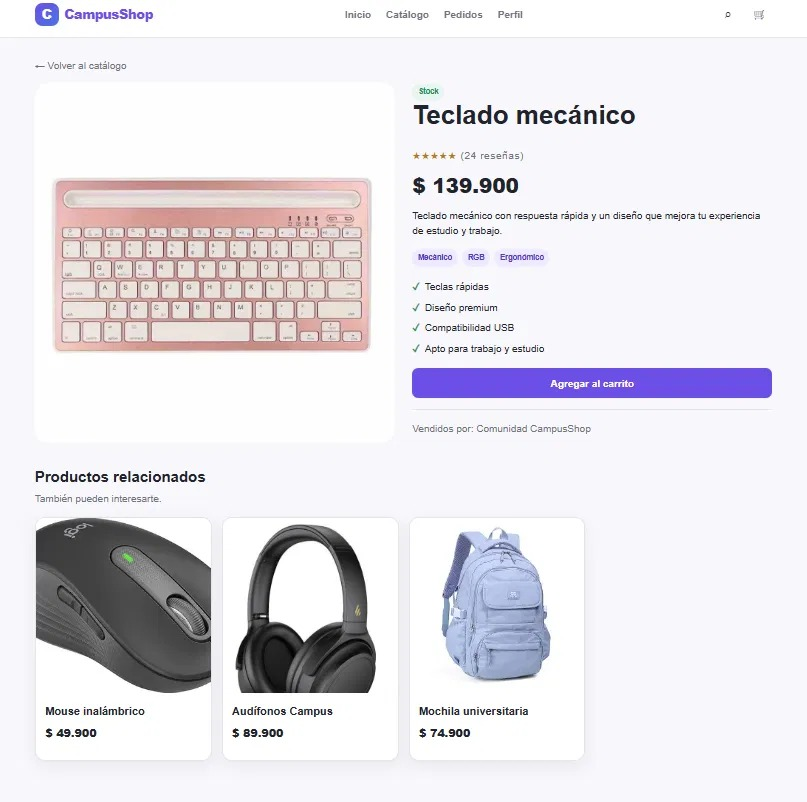
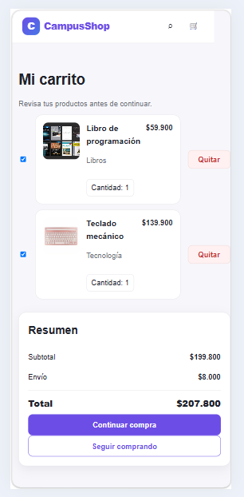
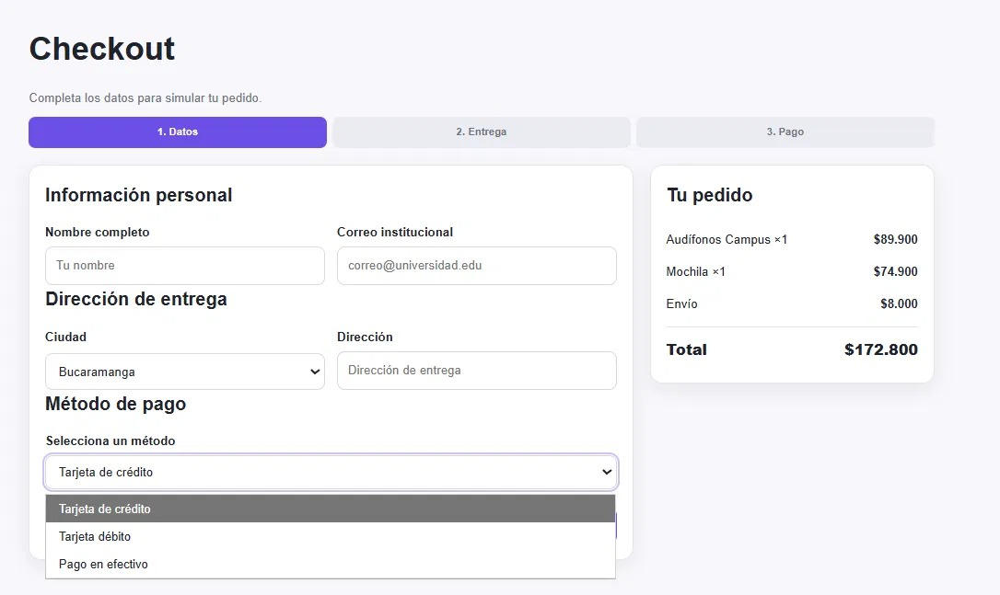
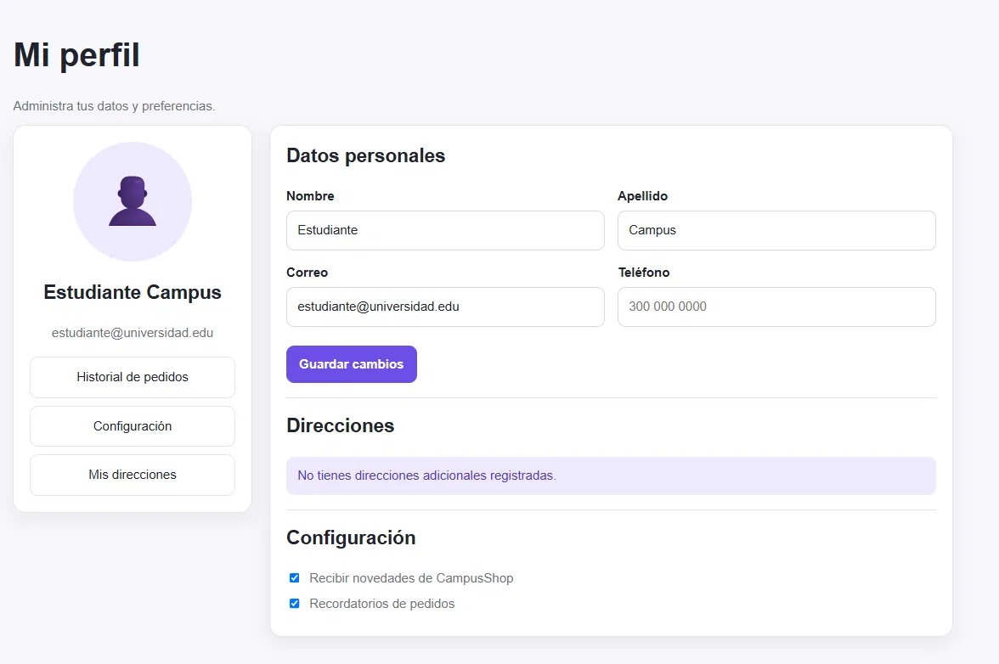
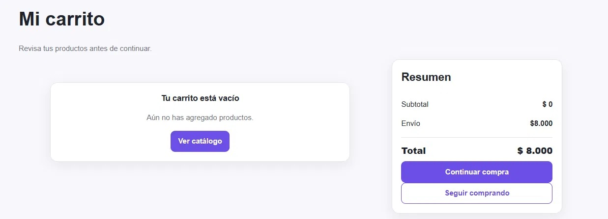
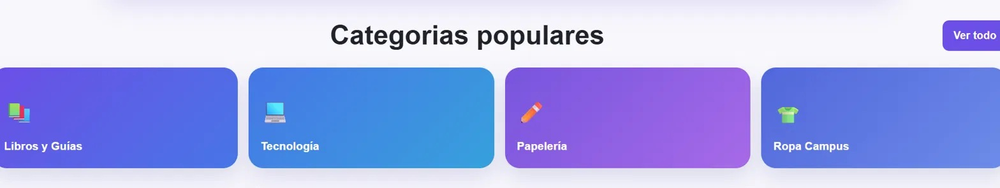

# 🛒 CampusShop

CampusShop es una tienda en línea pensada para estudiantes universitarios, donde pueden encontrar tecnología, ropa, libros y papelería para su vida académica.

## 📋 Descripción

El proyecto simula una plataforma de e-commerce completa, con navegación por categorías, catálogo de productos, carrito de compras, proceso de checkout y gestión de perfil de usuario.

## ✨ Funcionalidades

### Página de inicio
- Categorías populares destacadas: **Libros y Guías**, **Tecnología**, **Papelería** y **Ropa Campus**.

### Catálogo de productos
- Filtros por 
**categoría** (Tecnología, Ropa, Libros), 
**disponibilidad** (en stock, en oferta) y 
**rango de precio**.
- Ordenamiento de productos (ej. "Más recientes").
- Tarjetas de producto con imagen, nombre, categoría y precio.

### Detalle de producto
- Imagen, calificación por reseñas, precio, descripción y etiquetas (ej. Mecánico, RGB, Ergonómico).
- Lista de características del producto.
- Botón para agregar al carrito.
- Sección de **productos relacionados**.

### Carrito de compras
- Lista de productos agregados con cantidad y opción de quitar.
- Resumen de compra: subtotal, envío y total.
- Botones para continuar la compra o seguir comprando.
- Estado vacío cuando no hay productos en el carrito.

### Checkout
- Proceso guiado en 3 pasos: **Datos**, **Entrega** y **Pago**.
- Formulario con información personal (nombre, correo institucional) y dirección de entrega.
- Selección de método de pago (tarjeta de crédito, tarjeta débito, pago en efectivo).
- Resumen del pedido con total a pagar.

### Perfil de usuario
- Datos personales editables (nombre, apellido, correo, teléfono).
- Accesos rápidos a historial de pedidos, configuración y direcciones guardadas.
- Preferencias de notificaciones (novedades y recordatorios de pedidos).

### Historial de pedidos
- Listado de pedidos anteriores con número de orden, fecha, productos, estado (Entregado, En preparación, Cancelado) y total.

## 🛠️ Tecnologías utilizadas

- HTML5
- CSS3

## 📂 Estructura del proyecto

```
Proyecto_Campus_Shop/
├── Index.html
├── catalogo.html
├── producto.html
├── carrito.html
├── checkout.html
├── perfil.html
├── historial.html
├── vacio.html
├── css/
│   ├── base.css
│   ├── layout.css
│   ├── components.css
│   └── responsive.css
└── img/
```
## 📸 Capturas de Pantalla

A continuación se presentan las vistas principales maquetadas comparadas con los requerimientos del proyecto:

### 🏠 Vista Home


### 🛍️ Catálogo de Productos


### 📦 Detalle del Producto


### 🛒 Carrito de Compras


### 💳 Processo de Checkout


### 👤 Perfil y Historial de Pedidos


### 🚫 Pantalla Vacía / Error


###  prodcuctos Populares


## 🚀 Cómo usarlo

1. Clona este repositorio:
   ```
   git clone https://github.com/alfonzoplata134/Proyecto_Campus_Shop.git
   ```
2. Abre `Index.html` en tu navegador.

## 👩‍💻 Developers

Proyecto desarrollado por 
Jazmín Agudelo.
Alejandra Sarmiento.
Larry Gomez
